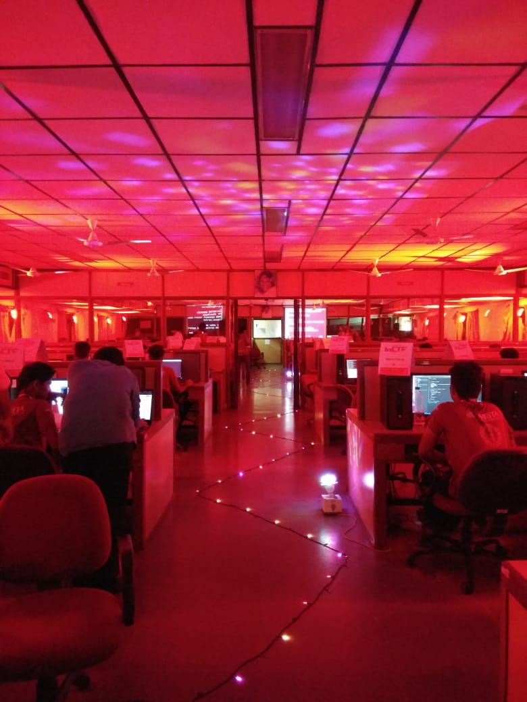
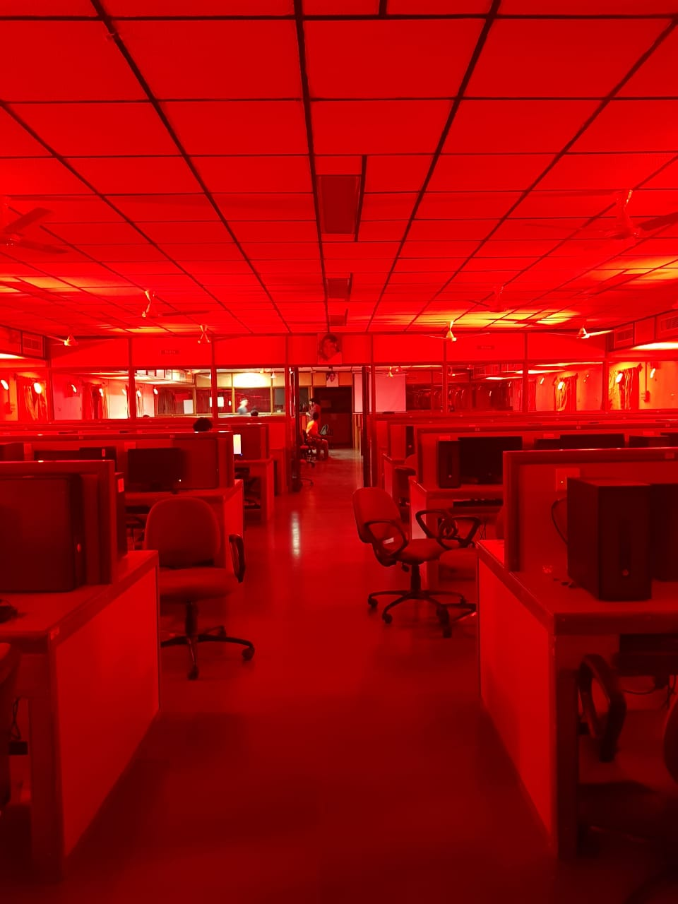
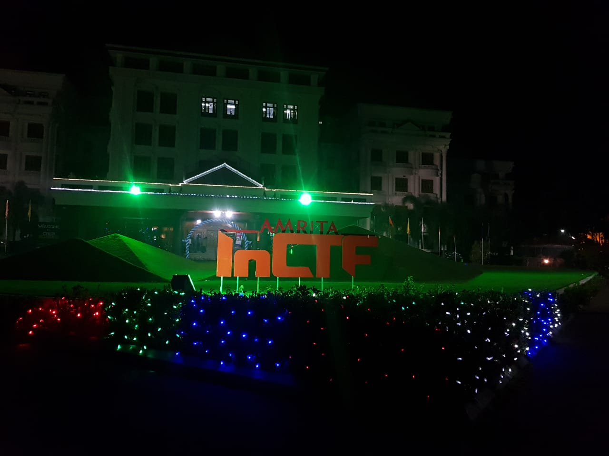
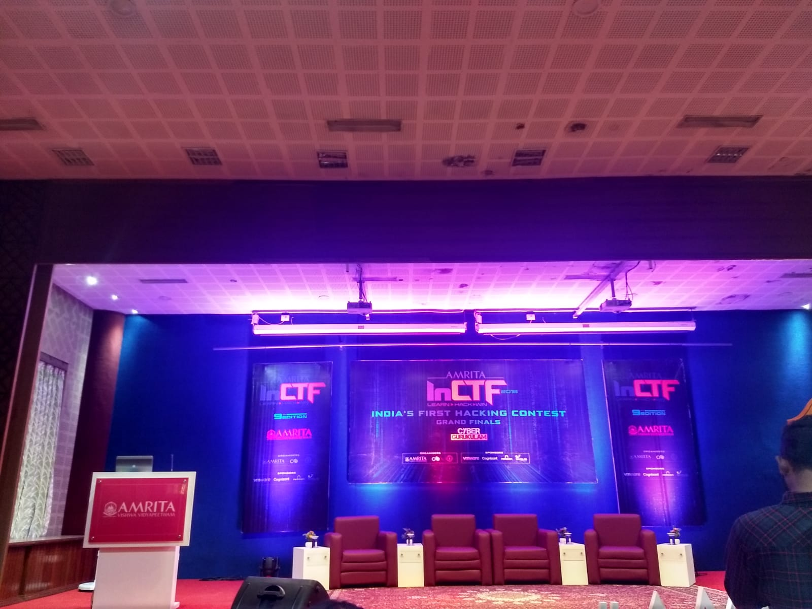
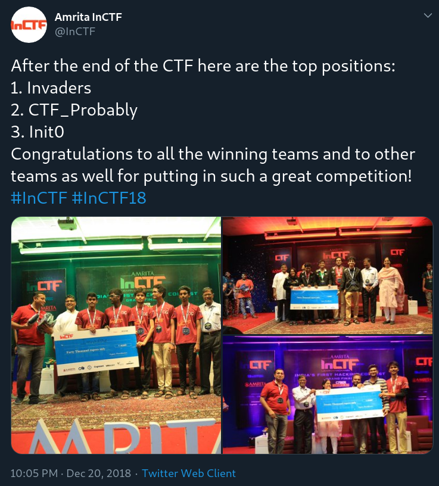
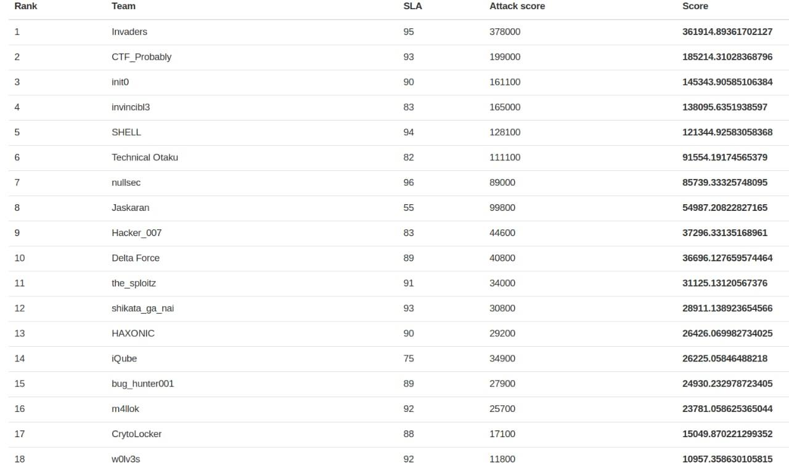
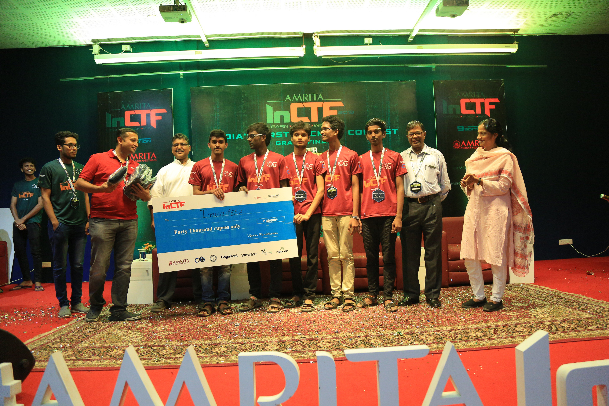
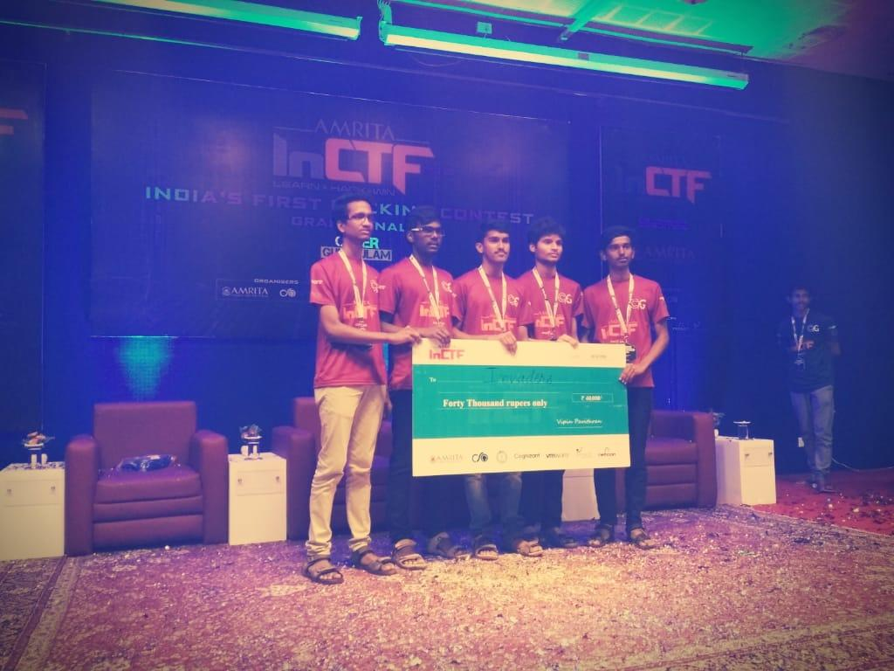
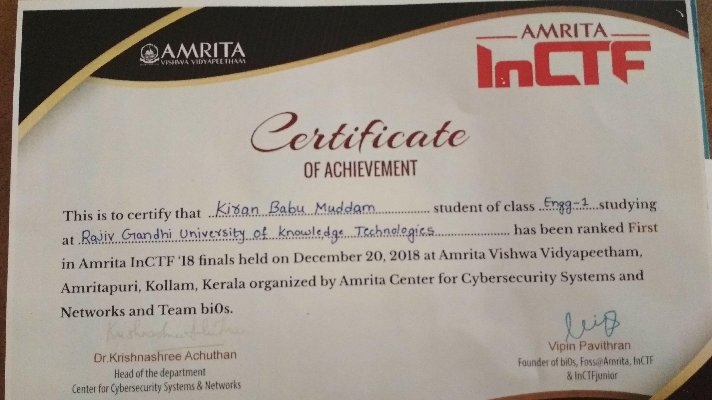
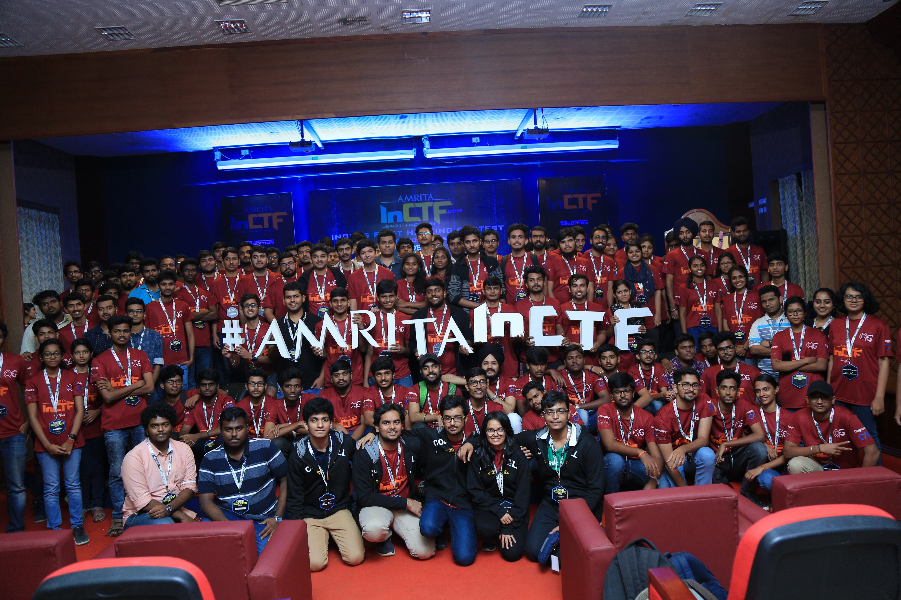

## Introduction

[InCTF 2018](https://inctf.in/) is 9th edition of India's Flagship Cybersecurity Contest. It consists of 1st round jeopardy style and 2nd round attack and defense style.

Amrita InCTF 2018 Statistics

```
Registrations - 2500+
States participated this year- 18 States and 4 Union Territories
No. of colleges - 1000+
```

### Our Team Name : Invaders

```
#InCTF Attack & Defense CTF has finally come to an end! Have a look at the final scoreboard of the Attack-Defense CTF Finals!

After the end of the CTF here are the top positions:
1. Invaders (Rajiv Gandhi University of Knowledge Technologies, Nuzvid)
2. CTF_Probably (K. J. Somaiya College of Engineering, Mumbai)
3. Init0 (National Institute of Technology, Rourkela)

Congratulations to all the winning teams and to other teams as well for putting in such a great competition!
```

## New Articles

```
https://news.franchiseindia.com/education/150-students-participate-in-finals-of-9th-edition-of-amrita-vishwa-vidyapeethams-national-ethical-hacking-contest.n17624
https://news.careers360.com/150-students-participate-9th-amrita-vishwa-vidyapeethams-national-ethical-hacking-contest-finals

```

## Social Media & Pics

### Venue & Setup









### Results and Scoreboard





## Awards Ceremony Pics





## Certificate



## Group Pic



## Final Words

It is an awesome experience for me. I had a lot of fun with other team participants, especillay at the beach. The organising team did a fantastic job.
